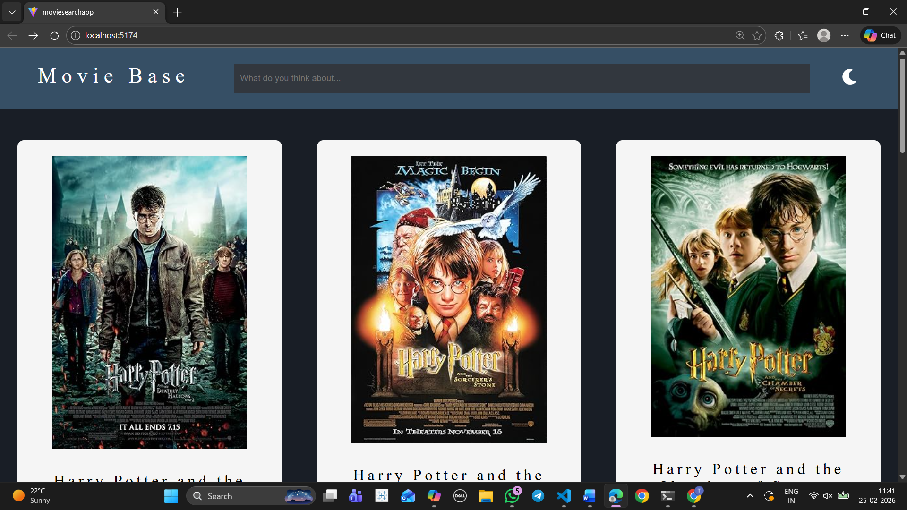
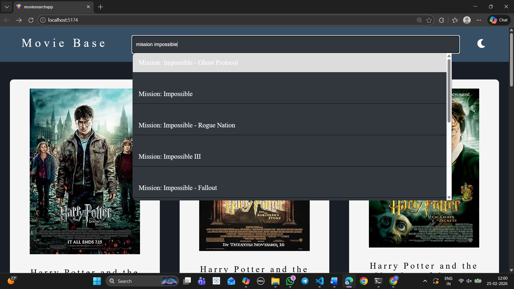
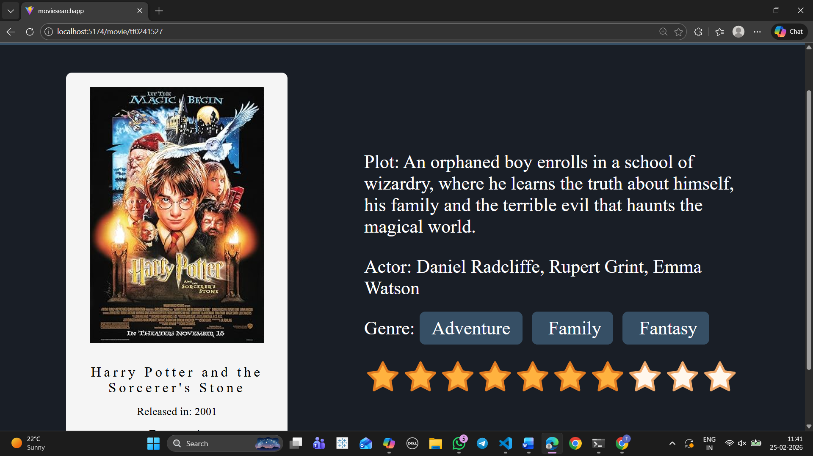

# 🎬 Movie Search App

A React-based movie search application powered by the OMDb API.  
Users can search for movies and view detailed information such as plot, genre, cast, ratings, and poster images.

---

## 🚀 Live Demo
https://your-demo-link.com *(replace with your live URL)*

---

## 📸 Screenshots

### Home Page


### Search Results


### Movie Details


## ✨ Features
- 🔍 Search movies by title  
- 📖 View detailed movie information (plot, genre, cast, ratings, poster)  
- 📱 Fully responsive UI  
- ⚡ Debounced search for better performance  
- 🧩 Clean and modular React components  
- 🚨 API error handling and loading states  

---

## 🛠 Tech Stack
- React (Vite / CRA)  
- JavaScript (ES6+)  
- HTML5  
- CSS3  
- OMDb API  

---

## 📂 Folder Structure
```plaintext
movie-search-app/
├── public/
├── src/
│   ├── components/        # Reusable React components
│   ├── pages/             # Page-level components
│   ├── hooks/             # Custom hooks (e.g., useDebounce)
│   ├── services/          # API calls and utilities
│   ├── styles/            # CSS modules or global styles
│   ├── assets/            # Static assets
│   ├── App.jsx            # Root component
│   └── main.jsx           # Entry point
├── .env                   # Environment variables (OMDb API key)
├── package.json
└── README.md

## ⚙️ Installation & Setup
1. Clone the repository:
   ```bash
   git clone https://github.com/your-username/movie-search-app.git
   cd movie-search-app

2. ''' bash 
    npm install
3. ''' bash 
    npm run dev
